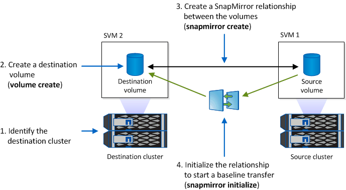

= SnapMirror レプリケーションのためのストレージシステムの準備
:allow-uri-read: 
:icons: font
:imagesdir: ../media/

[role="lead"]
SnapManager の統合された SnapMirror テクノロジを使用して Snapshot コピーをミラーリングするには、ソースボリュームとデスティネーションボリューム間のデータ保護関係を設定して初期化する必要があります。初期化の際に、 SnapMirror はソースボリュームの Snapshot コピーを作成して、そのコピーおよびコピーが参照するすべてのデータブロックをデスティネーションボリュームに転送します。また、ソースボリューム上の最新ではない Snapshot コピーもすべてデスティネーションボリュームに転送します。

* ピア Storage Virtual Machine （ SVM ）を含むピアクラスタにソースボリュームとデスティネーションボリュームを作成する必要があります。詳細については、『 clustered Data ONTAP クラスタピアリングエクスプレスガイド』を参照してください。
* クラスタ管理者である必要があります。
* デスティネーションボリュームで Snapshot コピーを検証する場合は、ソースとデスティネーションの Storage Virtual Machine （ SVM ）に管理 LIF とデータ LIF が必要です。管理 LIF の DNS 名は SVM と同じにする必要があります。管理 LIF のロールを data 、プロトコルを none 、ファイアウォールポリシーを mgmt に設定してください。

SnapMirror 関係は、 Data ONTAP コマンドラインインターフェイス（ CLI ）または OnCommand の System Manager を使用して作成できます。次の手順は、 CLI を使用することを前提としています。OnCommand System Manager を使用して SnapMirror 関係を作成する方法については、『 clustered Data ONTAP ボリュームディザスタリカバリ設定エクスプレスガイド』を参照してください。

次の図は、 SnapMirror 関係を初期化するための手順を示しています。

. デスティネーションクラスタを特定します。
. デスティネーションクラスタで、 -type DP オプションを指定して volume create コマンドを実行し、ソースボリュームと同じサイズ以上の SnapMirror デスティネーションボリュームを作成します。
+

IMPORTANT: デスティネーションボリュームの言語設定とソースボリュームの言語設定が一致している必要があります。

+
次のコマンドでは、アグリゲート node01_aggr の SVM2 に、 dstvolB という名前の 2GB のデスティネーションボリュームを作成します。

+
[listing]
----
cluster2::> volume create -vserver SVM2 -volume dstvolB -aggregate node01_aggr -type DP
-size 2GB
----
. デスティネーション SVM で、 -type DP パラメータを指定した snapmirror create コマンドを使用して、 SnapMirror 関係を作成します。
+
DP タイプは、 SnapMirror 関係として関係を定義します。

+
次のコマンドでは、 SVM1 のソースボリューム srcvolA と SVM2 のデスティネーションボリューム dstvolB との SnapMirror 関係を作成します。デフォルトでは、このコマンドはデフォルトの SnapMirror ポリシー DPDefault を割り当てます。

+
[listing]
----
SVM2::> snapmirror create -source-path SVM1:srcvolA -destination-path SVM2:dstvolB
-type DP
----
+

NOTE: SnapMirror 関係用のミラースケジュールを定義しないでください。これは、バックアップスケジュールの作成時に SnapManager によって自動的に定義されます。

+
デフォルトの SnapMirror ポリシーを使用しない場合は、 snapmirror policy create コマンドを呼び出して SnapMirror ポリシーを定義できます。

. snapmirror initialize コマンドを使用して、関係を初期化します。
+
初期化プロセスでは、デスティネーションボリュームへのベースライン転送が実行されます。SnapMirror はソースボリュームの Snapshot コピーを作成して、そのコピーおよびコピーが参照するすべてのデータブロックをデスティネーションボリュームに転送します。また、ソースボリューム上の他の Snapshot コピーもすべてデスティネーションボリュームに転送します。

+
次のコマンドでは、 SVM1 のソースボリューム srcvolA と SVM2 のデスティネーションボリューム dstvolB との関係を初期化します。

+
[listing]
----
SVM2::> snapmirror initialize -destination-path SVM2:dstvolB
----

* 関連情報 *

https://library.netapp.com/ecm/ecm_download_file/ECMP1547469["clustered Data ONTAP 8.3 クラスタピアリングエクスプレスガイド"]

https://library.netapp.com/ecm/ecm_download_file/ECMP1653500["clustered Data ONTAP 8.3 ボリュームディザスタリカバリ設定エクスプレスガイド"]
